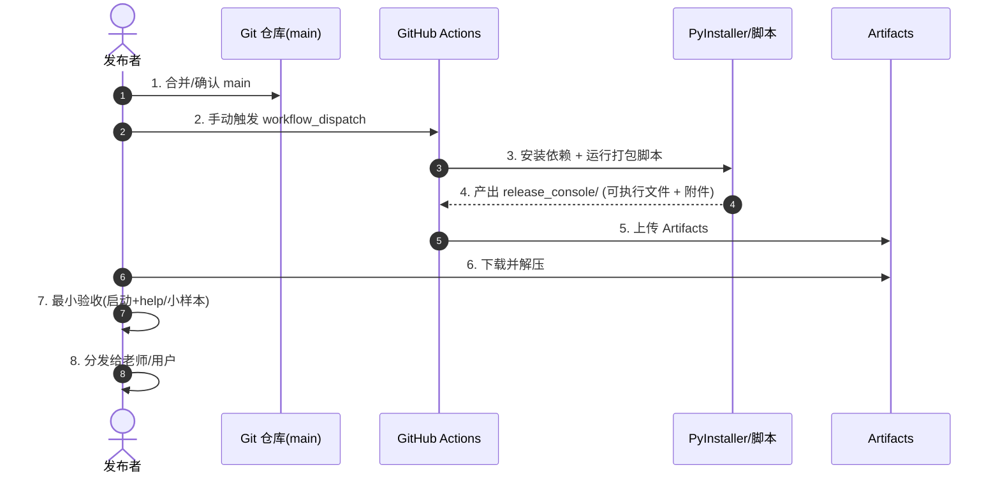

# 发布流程（从源码到 release_console）

**版本**: v0.4.0  
**更新日期**: 2025-12-31

面向发布维护者：把源码打包成可分发的控制台套件，并完成最小验收。

## 产物与目录约定

- 目标目录：`sunday-photos/release_console/`
- 关键文件：
  - 打包目录（onedir）：`release_console/SundayPhotoOrganizer/`
  - macOS 可执行文件：`release_console/SundayPhotoOrganizer/SundayPhotoOrganizer`
  - Windows 可执行文件：`release_console/SundayPhotoOrganizer/SundayPhotoOrganizer.exe`
  - 启动脚本：`release_console/启动工具.sh`（macOS）、`release_console/Launch_SundayPhotoOrganizer.bat`（Windows）
  - 说明文件：`release_console/使用说明.md`、`release_console/USAGE_EN.md`
  - 运行期目录（首次运行会自动创建）：`input/`, `output/`, `logs/`

## 总体时序图（发布者视角）

## 详细步骤（步骤 + 输入/输出）

### 0)（可选）本地快速验证源码可运行

- 输入：`sunday-photos/src/`，本地 Python 环境
- 命令：
  - `python sunday-photos/run.py --check-env`
  - 或 `python sunday-photos/src/cli/run.py --help`
- 输出：终端输出；不产生发布目录

### 1) macOS 本地打包（当前机器架构）

- 输入：
  - 源码：`sunday-photos/src/`
  - spec：`sunday-photos/SundayPhotoOrganizer.spec`
  - 脚本：`sunday-photos/scripts/build_mac_app.sh`
- 命令：
  - `cd sunday-photos`
  - `bash scripts/build_mac_app.sh`
- 输出：`sunday-photos/release_console/`（包含 `SundayPhotoOrganizer`）

> 说明：`TARGET_ARCH` 可用于在支持的环境中控制 macOS 架构输出（CI 会用到）。

### 2) Windows 本地打包（必须在 Windows 上执行）

- 输入：
  - 源码：`sunday-photos/src/`
  - spec：`sunday-photos/SundayPhotoOrganizer.spec`
  - 脚本：`sunday-photos/scripts/build_windows_console_app.ps1`
- 命令（PowerShell）：
  - `cd sunday-photos`
  - `powershell -ExecutionPolicy Bypass -File scripts\build_windows_console_app.ps1`
- 输出：`sunday-photos/release_console/`（包含 `SundayPhotoOrganizer.exe`）

> 说明：Windows 打包默认会把 InsightFace 模型一起打包进发布包（离线可用）。
> 这要求打包机上存在模型目录：`%USERPROFILE%\.insightface\models\buffalo_l`。
> 如需关闭打包模型（减小体积/加快构建）：`set BUNDLE_INSIGHTFACE_MODELS=0` 或 `$env:BUNDLE_INSIGHTFACE_MODELS="0"`。

### 3) CI 打包（推荐的发布方式）

- 输入：仓库 `main` 分支
- 动作：GitHub Actions 手动触发（`workflow_dispatch`）
- 输出（Artifacts）：
  - Windows：`windows-x86_64`（目录为 `sunday-photos/release_console/`）
  - macOS：`macos-universal`（解压后为 `release_console_universal/`）

macOS 通用包结构（一个下载包同时支持 Intel + Apple Silicon）：
- `release_console_universal/SundayPhotoOrganizer`（启动脚本，自动选择架构）
- `release_console_universal/bin/SundayPhotoOrganizer-x86_64`
- `release_console_universal/bin/SundayPhotoOrganizer-arm64`

### 4) 最小验收（建议发布前必做）

- 验收输入：小规模样本照片，放入：
  - `input/student_photos/`
  - `input/class_photos/`
- 验收动作：
  - `./SundayPhotoOrganizer --help`
  - 跑一遍最小流程（确保能生成 `output/`、`logs/`）
- 验收输出：
  - `output/`：按日期/学生的整理结果
  - `logs/`：日志文件（即便早退也应创建）

## 发布清单（建议）

- 确认 workflow 绿色（或至少完成并能下载 Artifacts）
- 下载并解压 Artifacts，按平台分别打包给用户
- 附带教师使用指南（doc/TeacherGuide*.md 对应的导出版本）
