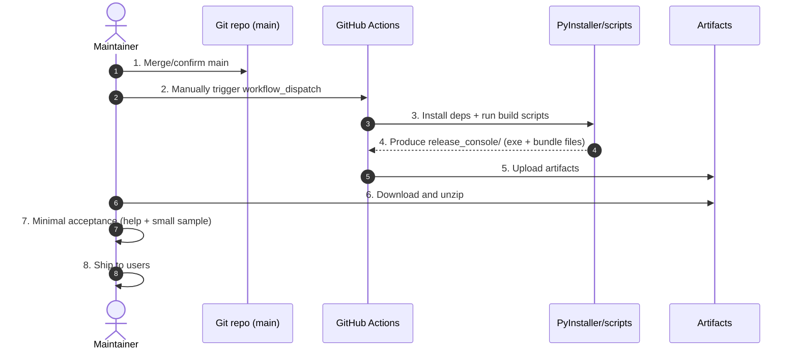

# Release Flow (Source → release_console)

**Version**: v0.4.0  
**Last updated**: 2025-12-31

For release maintainers: package the repo into a distributable console bundle and perform a minimal acceptance check.

## Outputs & directory conventions

- Target folder: `sunday-photos/release_console/`
- Key files:
  - Packaged folder (onedir): `release_console/SundayPhotoOrganizer/`
  - macOS executable: `release_console/SundayPhotoOrganizer/SundayPhotoOrganizer`
  - Windows executable: `release_console/SundayPhotoOrganizer/SundayPhotoOrganizer.exe`
  - Launchers: `release_console/启动工具.sh` (macOS), `release_console/Launch_SundayPhotoOrganizer.bat` (Windows)
  - Docs: `release_console/使用说明.md`, `release_console/USAGE_EN.md`
  - Runtime folders (auto-created on first run): `input/`, `output/`, `logs/`

## High-level sequence (maintainer view)

## Step-by-step (with inputs/outputs)

### 0) (Optional) quick local source sanity check

- Input: `sunday-photos/src/` + local Python env
- Commands:
  - `python sunday-photos/run.py --check-env`
  - or `python sunday-photos/src/cli/run.py --help`
- Output: console output only

### 1) Local packaging (macOS)

- Inputs:
  - Source: `sunday-photos/src/`
  - Spec: `sunday-photos/SundayPhotoOrganizer.spec`
  - Script: `sunday-photos/scripts/build_mac_app.sh`
- Commands:
  - `cd sunday-photos`
  - `bash scripts/build_mac_app.sh`
- Output: `sunday-photos/release_console/` (includes `SundayPhotoOrganizer`)

Note: `TARGET_ARCH` can be used to control the macOS build arch (CI uses it).

### 2) Local packaging (Windows)

PyInstaller does not cross-compile; run on Windows.

- Inputs:
  - Source: `sunday-photos/src/`
  - Spec: `sunday-photos/SundayPhotoOrganizer.spec`
  - Script: `sunday-photos/scripts/build_windows_console_app.ps1`
- Commands (PowerShell):
  - `cd sunday-photos`
  - `powershell -ExecutionPolicy Bypass -File scripts\build_windows_console_app.ps1`
- Output: `sunday-photos/release_console/` (includes `SundayPhotoOrganizer.exe`)

Note: Windows packaging now bundles the InsightFace model by default for offline use.
- Prerequisite on the build machine: `%USERPROFILE%\.insightface\models\buffalo_l`
- To opt out (smaller/faster build): set `BUNDLE_INSIGHTFACE_MODELS=0`

### 3) CI packaging (recommended for releases)

- Input: `main` branch
- Action: GitHub Actions manual run (`workflow_dispatch`)
- Outputs (Artifacts):
  - Windows: `windows-x86_64` (folder `sunday-photos/release_console/`)
  - macOS: `macos-universal` (unzips to `release_console_universal/`)

macOS universal bundle layout (single download supports both Intel + Apple Silicon):
- `release_console_universal/SundayPhotoOrganizer` (launcher script; auto-selects arch)
- `release_console_universal/bin/SundayPhotoOrganizer-x86_64`
- `release_console_universal/bin/SundayPhotoOrganizer-arm64`

### 4) Minimal acceptance (recommended before shipping)

- Test input:
  - `input/student_photos/`
  - `input/class_photos/`
- Actions:
  - `./SundayPhotoOrganizer --help`
  - Run a small end-to-end pipeline (ensure `output/` and `logs/` are created)
- Outputs:
  - `output/`: organized results
  - `logs/`: log file(s) (should exist even on early exit)

## Release checklist (suggested)

- Ensure workflows complete and artifacts are downloadable
- Download/unzip artifacts and distribute per platform
- Ship along with the Teacher Guide exports
