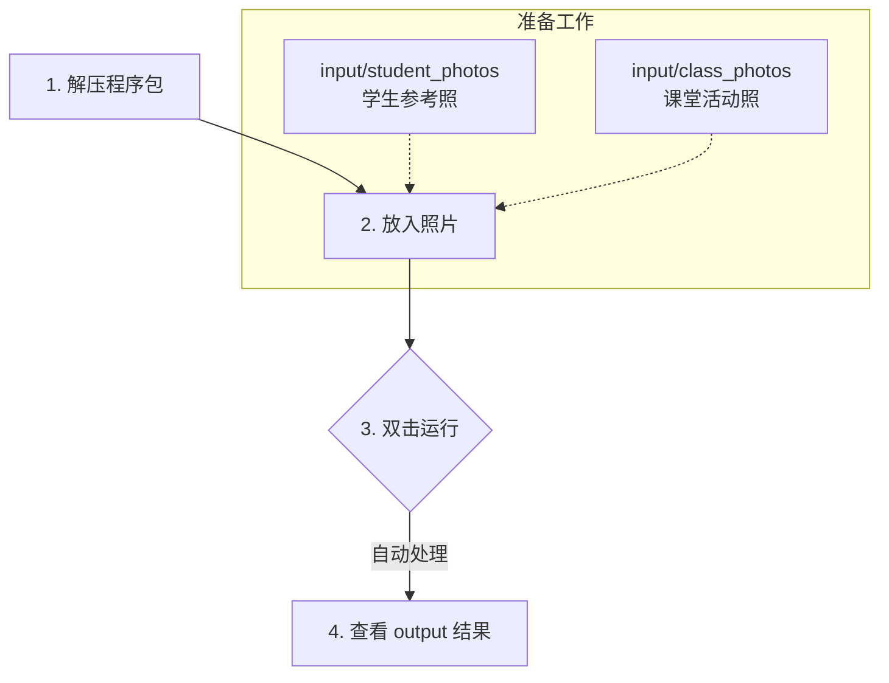

# 老师快速开始（macOS / Windows）

**版本**: v0.4.0  
**更新日期**: 2026-01-02

这份说明是给老师的：**不需要懂电脑**，照做即可。

## 你需要准备什么

- 一份“学生参考照”（用于识别每位学生）
- 一份“课堂/活动照片”（需要整理的照片）

## 3 步完成（最重要）

### 第 1 步：解压
1. 下载老师发给你的压缩包（例如：`SundayPhotoOrganizer_macOS.zip`）
2. 解压到桌面（推荐）或任何你方便的位置
3. 解压后会看到一个文件夹（例如：`SundayPhotoOrganizer/`）

**重要**：程序会自动在这个文件夹里创建工作目录，包括：
- `input/`（放照片的地方）
- `output/`（结果的地方）
- `logs/`（日志文件）

如果程序无法在这里创建（例如权限问题），会自动改用桌面，并在运行时告诉你实际位置。

### 第 2 步：把照片放进 input
打开解压后的文件夹，找到：
- `input/student_photos/`：放**学生参考照**（每个学生一个文件夹，每人 1~5 张，清晰正脸最好）
- `input/class_photos/`：放**课堂/活动照**（你今天拍的所有合照/抓拍）

小提示（避免困惑）：
- 课堂照建议按日期建子目录（例如 `input/class_photos/2025-12-25/...`）。
- 如果你直接把照片放在 `class_photos/` 根目录，程序会自动按日期归档到子目录；遇到同名文件会自动改名（如 `photo.jpg` → `photo_001.jpg`）避免覆盖。

示例（你可以照着理解，不需要完全一样）：
- `input/student_photos/张三/张三_1.jpg`
- `input/student_photos/张三/张三_2.jpg`
- `input/student_photos/李四/李四_1.jpg`
- `input/class_photos/2025-12-25_圣诞活动_001.jpg`
- `input/class_photos/2025-12-25_圣诞活动_002.jpg`

### 第 3 步：运行（只点一个入口）
在解压后的文件夹里，找到并运行：

- macOS：
	- 如果你拿到的是 `.app` 版本：双击 `SundayPhotoOrganizer.app`
	- 如果你拿到的是控制台版：首次推荐双击 `启动工具.command`（备选：`启动工具.sh`）
- Windows：双击 `Launch_SundayPhotoOrganizer.bat`

**macOS 首次网络下载/AirDrop 接收后**：如果提示"无法打开"，请先双击 `首次运行前清理.command`，或者右键点击 .app → 选择"打开"。

运行中：会弹出一个黑色窗口并显示进度，**请不要关闭**。

#### 小问题速查
- 一闪而过/没输出：先看控制台首行 `Work folder: ...`，确认路径可写，再查 `logs/` 最新日志。
- output 为空：确认 `class_photos/` 里确实有照片；缺课堂照会直接退出。
- 全部进 unknown：检查参考照是否清晰正脸、单人，数量 1-5 张；参见 FAQ “识别不准怎么办”。
- 更多：见 FAQ.md；排障详见 HealthCheck_Runtime.md。

## 结果在哪里

- 整理结果在：`output/`
- 运行日志在：`logs/`

你在 `output/` 里通常会看到：
- `output/<学生名>/YYYY-MM-DD/`：该学生在当天的照片
- `output/unknown_photos/`：没能归到已知学生的照片（也可能是无人脸/处理出错；报告会分列统计）
- `output/*_整理报告.txt`：本次整理的统计与说明（文件名带时间戳）

更多说明（一般用不上）：
- 详细老师指南：`doc/TeacherGuide.md`
- 配置与高级选项（配置参考手册 / SSOT）：`doc/CONFIG_REFERENCE.md`

## 最常见问题（看这里就够了）

### 1) macOS 提示“无法打开，因为无法验证开发者”
这是 macOS 的安全提示，不是你操作错。

处理方法（两种任选其一）：

A. 系统设置方式（推荐）
1. 先点“取消”
2. 打开「系统设置」→「隐私与安全性」
3. 往下翻，找到“已阻止打开 SundayPhotoOrganizer”或“SundayPhotoOrganizer.app”
4. 点“仍要打开（Open Anyway）”
5. 回到文件夹，再双击运行一次

B. 右键打开方式
1. 右键 `SundayPhotoOrganizer` → 选择「打开」
2. 再点一次「打开」确认

### 2) 双击后窗口一闪就没了 / 没反应
请按顺序检查：
1. 确认照片放在 `input/student_photos/` 和 `input/class_photos/`
2. 确认你点的是入口（macOS 点 `SundayPhotoOrganizer.app` 或 `启动工具.sh`；Windows 点 `.bat`）
3. 仍不行：把 `logs/` 文件夹发给技术同工

### 3) 第一次运行提示“Matplotlib is building the font cache”
这是正常现象：程序首次运行会生成一次字体缓存。

老师版 `.app` 已内置优化：字体缓存会写到工作目录的 `logs/mplconfig/`；第一次生成后，后续启动会明显更快。

### 4) 程序报错 / 闪退 / 提示权限问题（1 分钟排查）
请按这个顺序做（大多数问题 1 分钟内能定位）：

1. **先看工作目录在哪里**：
	- 控制台版会在黑色窗口里打印 `Work folder: ...`（以这行显示为准）。
	- 如果你使用的是 macOS 老师版 `.app`（不弹终端），工作目录通常就是 `.app` 旁边的文件夹。
2. **确认输入目录是否正确**：
	- `input/student_photos/` 下每个学生一个文件夹
	- `input/class_photos/` 下确实有课堂照片
3. **看日志与报告**：
	- `logs/`：程序运行日志
	- `output/*_整理报告.txt`：本次运行的统计与说明（即使没有分类成功，报告也常会告诉原因）

如果仍然无法解决：把下面“要发的材料”发给技术同工。

## 如果出错，你只需要发我两样东西

1. `logs/` 文件夹（整个打包发我）
	- macOS 老师版 `.app` 也请附上：`logs/teacher_app_console.log`（如果存在）
2. 你看到的报错截图（如果有）

---

给老师的一句话总结：
- “解压 → 放照片到 input → 点运行 → 去 output 拿结果；有问题发 logs。”
