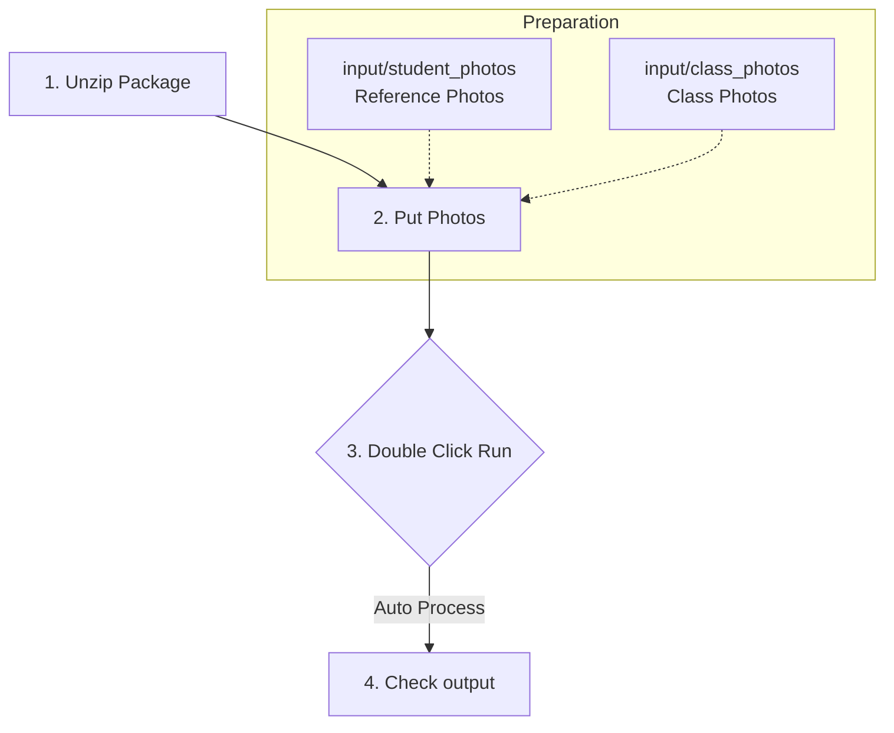

# Teacher Quick Start (macOS / Windows)

**Version**: v0.4.0  
**Last updated**: 2026-01-02

This guide is for teachers: no technical background required.

## What you need

- Student reference photos (to recognize each student)
- Class/event photos (the photos to organize)

## 3 steps (the only steps you need)

### Step 1: Unzip
1. Download the zip file you received (e.g., `SundayPhotoOrganizer_macOS.zip`)
2. Unzip it to Desktop (recommended) or anywhere convenient
3. You'll see a folder (e.g., `SundayPhotoOrganizer/`)

**Important**: The app auto-creates the working folders inside this directory:
- `input/` (where you put photos)
- `output/` (where results appear)
- `logs/` (log files)

If the app can't write here (permission issues), it falls back to Desktop and tells you the actual location when running.

### Step 2: Put photos into input
Open the unzipped folder and locate:
- `input/student_photos/`: put **student reference photos** (one folder per student; 1–5 per student; clear frontal face works best)
- `input/class_photos/`: put **class/event photos** (all photos you want to organize)

Tip (to avoid surprises):
- Date subfolders are recommended (e.g. `input/class_photos/2025-12-25/...`).
- If you put photos directly under `class_photos/`, the app will auto-sort them into date folders. If there is a filename conflict, it auto-renames (e.g. `photo.jpg` → `photo_001.jpg`) to avoid overwriting.

Examples (your filenames can be different):
- `input/student_photos/Alice/Alice_1.jpg`
- `input/student_photos/Alice/Alice_2.jpg`
- `input/student_photos/Bob/Bob_1.jpg`
- `input/class_photos/2025-12-25_Christmas_Event_001.jpg`
- `input/class_photos/2025-12-25_Christmas_Event_002.jpg`

### Step 3: Run (single entrypoint)
Inside the unzipped folder, run:

- macOS: double-click `SundayPhotoOrganizer.app` (recommended) or `启动工具.sh`
- Windows: double-click `Launch_SundayPhotoOrganizer.bat`

**macOS first-time after network download/AirDrop**: If it says "cannot open", first double-click `首次运行前清理.command`, or right-click the .app → choose "Open".

While running: a black window shows progress. **Do not close it**.

#### Quick troubleshooting
- Window flashes/no output: check first line `Work folder: ...` is writable, then open the latest log in `logs/`.
- Empty output: ensure there are photos under `class_photos/`; missing classroom photos cause a safe exit.
- Everything unknown: ensure reference photos are clear frontal, single-person, 1–5 per student; see FAQ “Low accuracy”.
- More: see FAQ_en.md; deeper steps in HealthCheck_Runtime_en.md.

## Where are the results?

- Results: `output/`
- Logs: `logs/`

In `output/`, you typically see:
- `output/<student>/YYYY-MM-DD/`: that student’s photos for that date
- `output/unknown_photos/`: not matched to known students (can also include no-face / error; the report separates counts)
- `output/*_整理报告.txt`: run report with statistics (timestamped filename)

More docs (usually not needed):
- Full teacher guide: `doc/TeacherGuide_en.md`
- Configuration & advanced options (SSOT): `doc/CONFIG_REFERENCE_en.md` (or the archived pointer `doc/CONFIG_en.md`)

## Common issues

### 1) macOS says it "can’t be opened" / "developer cannot be verified"
This is a macOS security prompt.

Option A (recommended):
1. Click Cancel
2. Open System Settings → Privacy & Security
3. Find the blocked app message
4. Click “Open Anyway”
5. Go back and open it again

Option B:
1. Right click `SundayPhotoOrganizer.app` → Open
2. Confirm Open again

### 2) Window closes immediately / nothing happens
1. Ensure photos are inside `input/student_photos/` and `input/class_photos/`
2. Ensure you are launching the entrypoint (macOS: `SundayPhotoOrganizer.app` or `启动工具.sh`; Windows: the `.bat`)
3. If still stuck: send the entire `logs/` folder to the maintainer

### 3) First run shows: “Matplotlib is building the font cache”
This is normal on the first run.

In the teacher packaged app, the font cache is written under the Work folder (typically `logs/mplconfig/`). After the first run, startup should be faster.

### 4) What is `Unknown_Person_X`?
This is the “unknown-face clustering” feature:
- `Unknown_Person_1` = the first cluster of similar unknown faces
- Useful for recurring visitors/parents/new students

What to do:
1. Open `output/unknown_photos/Unknown_Person_X/`
2. If it is a new student, pick 2–3 clear photos and add them into `input/student_photos/<student_name>/`
3. Run again

### 5) How do I force a full rerun?
Simplest:
- Rename the date folder under `input/class_photos/` (e.g. `2025-12-21` → `2025-12-21-new`), then run again.

More thorough (optional):
- Delete `output/.state/` (incremental records), then run again.

### 6) I see photos under `unknown_photos/` — is that bad?
Not necessarily.
- Some photos have faces too small/blurred → counted as unknown
- Some photos contain no faces (slides/scenery) → counted as no-face
- Corrupted/unreadable files → counted as error

Open the newest `output/*_整理报告.txt` to see the breakdown.

### 7) Recognition is inaccurate
Don’t tune parameters first. Try this:
1. Add 2–3 clearer reference photos for that student (frontal, sharp, not blocked)
2. Don’t use group photos as reference photos
3. Use clearer classroom photos when possible (better lighting, larger faces)

### 8) It feels slow / stuck
Common reasons:
- First run downloads or loads models (especially InsightFace)
- First run builds caches (including Matplotlib font cache)
- Too many photos and the machine is low on memory

If needed, ask the maintainer to run in serial mode for troubleshooting (see `doc/CONFIG_REFERENCE_en.md`).

### 9) The program errors out — what should I send for help?
Please send:
1) The whole `logs/` folder (if the app fell back, use the `Work folder:` path printed in the console)
2) A short description + screenshot of the error (if any)

## If something goes wrong, send these two things

1. The whole `logs/` folder
2. A screenshot of the error (if any)

---

One-line summary:
- “Unzip → put photos into input → run → check output; if error, send logs.”
